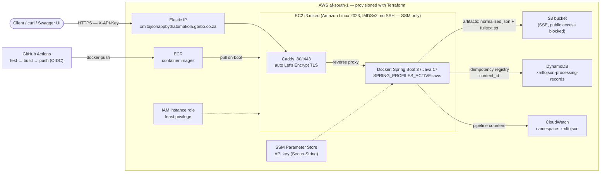

# xmltojson-judgment-transformation

Spring Boot service that ingests legal XML judgments, validates them against an XSD,
transforms valid documents to normalized JSON with XSLT 3.0 (Saxon-HE), and publishes
artifacts for downstream search/RAG. Design notes and trade-offs live in
[DESIGN_NOTES_AND_TRADEOFFS.md](DESIGN_NOTES_AND_TRADEOFFS.md).

## AWS architecture



All infrastructure is defined in [`terraform/`](terraform/): ECR repository (scan-on-push,
lifecycle policy), S3 artifact bucket (encrypted, public access blocked), DynamoDB registry
table, least-privilege IAM instance role (ECR pull, bucket-scoped S3, table-scoped DynamoDB,
namespace-scoped CloudWatch, SSM Session Manager instead of SSH), security group (80/443
only), EC2 instance running the app behind a Caddy TLS reverse proxy, and an Elastic IP.
The API key is generated by Terraform and stored in SSM Parameter Store (SecureString).

```bash
cd terraform
terraform init
terraform apply -target=aws_ecr_repository.app   # registry first
# build & push the image (see Docker section), then:
terraform apply
```

Secrets are never committed: the API key is generated at apply time, stored in SSM
Parameter Store, and retrieved with
`aws ssm get-parameter --name /xmltojson-judgment-transformation/api-key --with-decryption`.
Terraform state and tfvars are gitignored. After `apply`, point the domain's A record at
the `public_ip` output; Caddy then obtains the Let's Encrypt certificate automatically.

## Requirements

- Java 17+
- Maven 3.9+

## Run it

```bash
mvn spring-boot:run
```

The service starts on `http://localhost:8080`. Swagger UI: `http://localhost:8080/swagger-ui.html`.

## Try it

Submit a document (raw XML body):

```bash
curl -X POST http://localhost:8080/api/documents \
  -H "Content-Type: application/xml" \
  --data-binary @samples/valid-judgment.xml
```

Or upload it as a file:

```bash
curl -X POST http://localhost:8080/api/documents/upload \
  -F "file=@samples/valid-judgment.xml"
```

Fetch status and artifacts:

```bash
curl http://localhost:8080/api/documents/FR-2024-CA-000123          # status + diagnostics
curl http://localhost:8080/api/documents/FR-2024-CA-000123/json     # normalized JSON
curl http://localhost:8080/api/documents/FR-2024-CA-000123/text     # plain text for RAG
```

Invalid documents are rejected (HTTP 422) with full diagnostics (severity, line, column,
message) and nothing is published. Resubmitting identical content is an idempotent no-op
(`duplicate: true`).

## Batch processing

Point the batch endpoint at a folder (or an `s3://bucket/prefix` when running with the
`aws` profile):

```bash
curl -X POST http://localhost:8080/api/batches \
  -H "Content-Type: application/json" \
  -d "{\"inputDir\": \"./samples/bulk\"}"

curl http://localhost:8080/api/batches/{batchId}   # progress and counts
```

Files are processed concurrently by a bounded worker pool. Batch artifacts are grouped
under a `bulk/` collection in the output location.

## Configuration

Everything operational is a property, overridable via environment variables:

| Property | Default | Purpose |
|---|---|---|
| `app.pipeline.concurrency` | `4` | Worker pool size for batch processing |
| `app.pipeline.max-document-size-bytes` | `10485760` | Reject oversized documents early |
| `app.pipeline.batch-collection` | `bulk` | Collection batch-ingested artifacts are filed under |
| `app.transform.stylesheet` | `xslt/judgment-to-json.xsl` | XSLT 3.0 stylesheet (classpath) |
| `app.transform.schema` | `schema/judgment.xsd` | XSD used for validation (classpath) |
| `app.storage.type` | `filesystem` | `filesystem` or `s3` |
| `app.storage.output-dir` | `./output` | Artifact root (filesystem mode) |
| `app.storage.bucket` | - | Artifact bucket (s3 mode) |
| `app.storage.normalized-json-file-name` | `normalized.json` | Normalized JSON artifact file name |
| `app.storage.full-text-file-name` | `fulltext.txt` | Full-text artifact file name |
| `app.registry.type` | `in-memory` | `in-memory` or `dynamodb` |
| `app.registry.table` | `xmltojson-processing-records` | Registry table (dynamodb mode) |
| `app.security.api-key` | - | Shared API key; unset = auth disabled |
| `app.security.api-key-header` | `X-API-Key` | Header carrying the key |
| `app.security.protected-path-prefix` | `/api/` | Path prefix guarded by the key |
| `app.metrics.cloudwatch-enabled` | `false` | Publish pipeline counters to CloudWatch |
| `app.metrics.cloudwatch-namespace` | `xmltojson` | CloudWatch metric namespace |
| `app.metrics.cloudwatch-step` | `PT1M` | CloudWatch publish interval |

Profiles: `local` (default), `docker`, `aws` (S3 storage + DynamoDB registry + CloudWatch
metrics). E.g. `SPRING_PROFILES_ACTIVE=aws`.

Security: set `app.security.api-key` (env `APP_SECURITY_API_KEY`) to require an
`X-API-Key` header on all `/api/**` requests (401 otherwise). Unset - as in local
development - the API is open. Health probes and Swagger docs are always public;
in Swagger UI use the Authorize button to supply the key.

## Operability

Health / readiness probes:

- `http://localhost:8080/actuator/health` - overall UP + liveness/readiness groups
- `.../actuator/health/liveness` and `.../actuator/health/readiness` - the individual probes

Pipeline metrics (operator counters and timers):

- `.../actuator/metrics` - catalog of all metric names
- `.../actuator/metrics/documents.received`
- `.../actuator/metrics/documents.published`
- `.../actuator/metrics/documents.rejected`
- `.../actuator/metrics/documents.duplicate`
- `.../actuator/metrics/documents.validation.duration` - count + total + max time
- `.../actuator/metrics/documents.transformation.duration`

Plus the JVM/system freebies: `jvm.memory.used`, `http.server.requests` (per-endpoint
latencies), and friends.

Prometheus format (all metrics on one page):

- `.../actuator/prometheus` - every metric in one scrape-able text dump

In the `aws` profile, logs and the pipeline counters also ship to CloudWatch.

## Tests

```bash
mvn test
```

## Docker

```bash
docker build -t xmltojson-judgment-transformation .
docker run -p 8080:8080 xmltojson-judgment-transformation
```

CI (GitHub Actions) runs the test suite and pushes the image to ECR on main.
